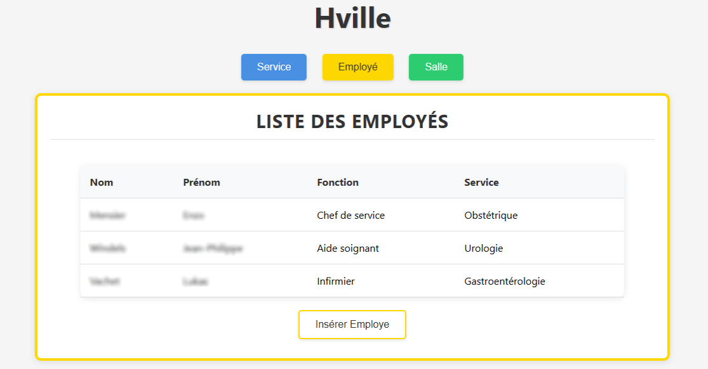

# Hville - Développement web

## Description

Le projet "Hville" est un mini-projet scolaire de programmation qui permet de liée **front-end** et **back-end** à travers une gestion de **base de données**. Ce projet est réalisé principalement en **PHP** mais aussi en **CSS**.

## Expression des besoin

Le centre hospitalier **Hville**, cherche à mettre en place des signalétiques intelligentes au niveau des chambres médicales des différents services ainsi que les bureaux des chefs de services.

<u>La signalétique va nous permettre de récupérer :</u><br>
▪ La température de la chambre médicalisée,<br>
▪ Le numéro de la chambre ou le bureau.

<u>Le responsable informatique vous a choisis comme technicien responsable de cette tâche pour permettre la prise en compte des besoins suivants :</u><br>
▪ Mise en place d’une base de données avec une meilleure sécurité,<br>
▪ Améliorer l’accès aux ressources,<br>
▪ Réduire la consommation électrique.

## Extrait du projet

<div style="text-align: center;">

</div>

## Fonctionnalités

- **Gestion des chambres et bureaux** : Enregistrement et affichage des données sur les chambres et bureaux.
- **Affichage dynamique** : Consultation en temps réel des températures et numéros des chambres.
- **Sécurisation des accès** : Gestion des utilisateurs avec des permissions spécifiques.
- **Interface intuitive** : Une interface utilisateur simple et ergonomique.

## Technologies utilisées

- **PHP** : Utilisé pour la gestion du back-end, traitement des données et génération dynamique des questions.
- **MySQL** : Gestion des données et stockage des informations liées aux chambres et bureaux.
- **CSS** : Structure et mise en forme de l'application.

## Objectifs

Ce projet vise à renforcer nos compétences en développement web, en particulier en **PHP**, **MySQL** et **CSS**, tout en permettant de réaliser un projet concret et utile dans un cadre médical.

## Installation

1. Clonez ce dépôt sur votre machine locale :
   ```bash
   git clone https://github.com/enzo-mensier/Hville.git
